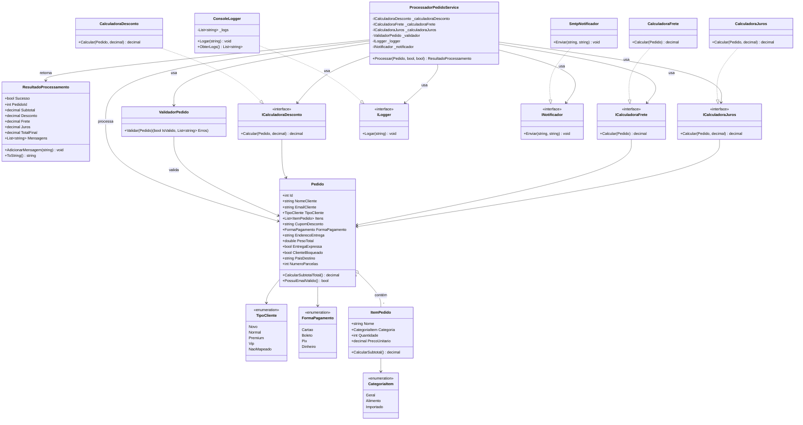

# Relatório de Atividade: Engenharia Reversa e Reestruturação

Este repositório contém a entrega completa das Partes 01, 02 e 03 da atividade de Melhoria de Sistemas Legados.
Alunos: Keven Lucas e Fernanda Galvão

## 📍 Guia de Navegação

### Parte 01: Engenharia Reversa
A análise do código original identificou as seguintes responsabilidades e regras implícitas:
- **Responsabilidade:** Processamento centralizador de pedidos.
- **Regras Mapeadas:** Cálculos de Frete (Nacional/Inter), Descontos (VIP/Premium/Novo), Juros (Cartão) e Alertas de Segurança.
- **Documentação:** O arquivo [SistemaLegadoPedidos.cs](./SistemaLegadoPedidos.cs) foi comentado detalhando cada um desses pontos.

### Parte 02: Redocumentação e Semântica
Focamos em transformar o "código obscuro" em algo compreensível:
- **Nomes Adequados:** Variáveis como `l` viraram `_logsDoSistema` e `temErro` virou `possuiViolacoesDeRegra`.
- **Justificativa:** A renomeação seguiu o padrão *Clean Code*, removendo ambiguidades e tornando o código "autodocumentado".
- **Diagrama de Classes:** O diagrama abaixo representa a estrutura refatorada do sistema, evidenciando a separação entre entidades do domínio, serviços de processamento, interfaces de cálculo e componentes de infraestrutura.
## Diagrama de Classes

### Parte 03: Reestruturação Arquitetural (Caminho para o Nível Superior)
Nesta fase, fomos além da simples reescrita e propusemos uma nova arquitetura (pasta `SistemaPedidosModerno/`):

1. **Separação de Camadas:** 
   - `Core`: enums, interfaces e modelos centrais do domínio;
   - `Services`: processamento do pedido, validação e cálculos de negócio;
   - `Infrastructure`: logging e notificação.
2. **Uso de Design Patterns:**
   - **Strategy:** Para as calculadoras financeiras (facilita a inclusão de novas regras sem modificar o serviço principal).
   - **Dependency Inversion:** O software depende de abstrações, não de implementações concretas (Log/Email).
3. **Resultado Estruturado:** Introdução da classe `ResultadoProcessamento`, permitindo que o sistema seja consultado programaticamente em vez de apenas retornar texto puro.

---
**Conclusão:** O projeto migrou de um estado de **Dívida Técnica Crítica** para uma estrutura modular, escalável e de fácil manutenção, respeitando rigorosamente os princípios SOLID. A análise do sistema legado permitiu compreender seu funcionamento interno e identificar regras de negócio que estavam implícitas no código original. A partir dessa compreensão, foi possível redocumentar o domínio e propor uma reestruturação mais organizada, com separação de responsabilidades e melhor clareza das implementações.
